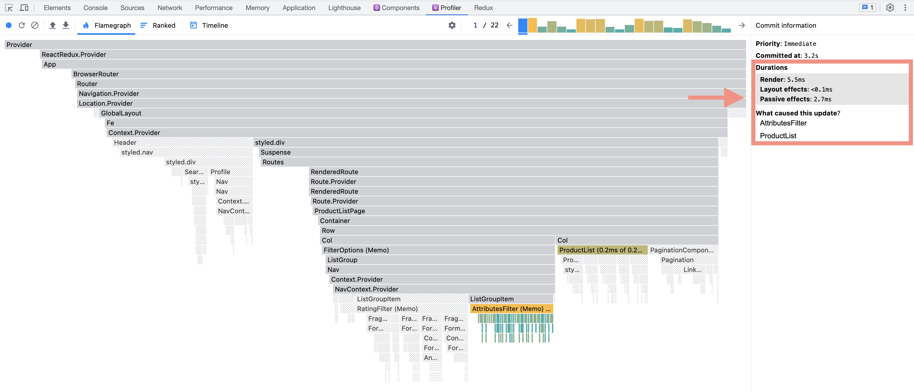
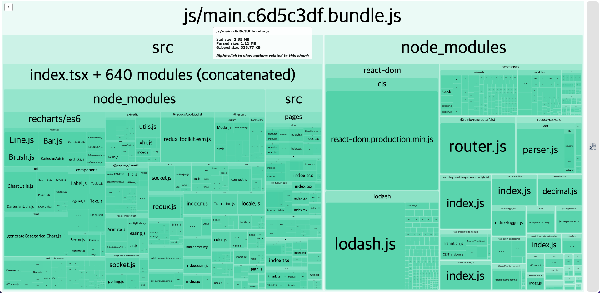
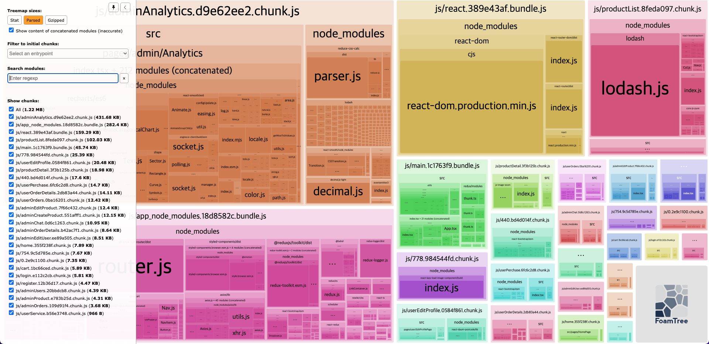
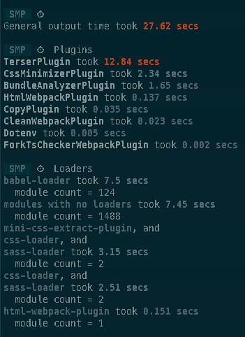
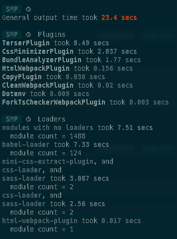
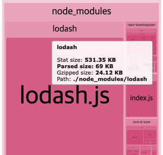
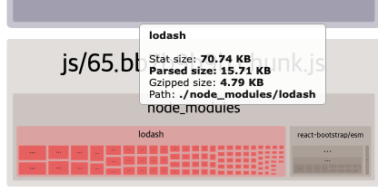
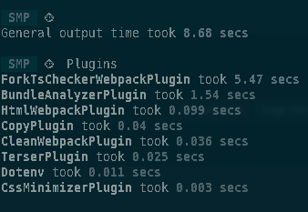

<div align="center" >

# 모시깽 마켓

</div>
서비스의 A to Z 를 경험하고 싶어, 프론트 부터 백엔드까지 구현한 쇼핑몰 프로젝트입니다. 빌드 시간 최적화, 모듈 번들러의 학습 경험을 위해 create-react-app을 사용하지 않고 webpack으로 react, typescript 환경을 구성하였습니다.

<br/><br/>

## 배포 주소

> https://msg-market.netlify.app/

<br/>

## 실행 방법
backend, frontend 디렉토리에서 각각 `yarn install` 명령어를 실행합니다.
```shell
$ cd backend
$ yarn install

$ cd frontend
$ yarn install
```

backend 디렉토리에서 `yarn dev` 명령어를 실행합니다.
```shell
$ cd backend
$ yarn dev
```

<br/>

## 기술스택

### frontend

[](https://skillicons.dev)

### backend

[](https://skillicons.dev)

<br/><br/>

## 실행화면

### 상품 목록 조회


<br/>

### 상품 필터 기능


<br/>

### 상품 상세 페이지


<br/>

### 장바구니 및 결제 페이지


<br/>

### 리뷰 등록 기능


<br/>

### 프로필 수정


<br/>

### 관리자 상품 관리 페이지


<br/><br/>

## 프로젝트 기록

### useSelector 최적화

- [해당 PR 링크](https://github.com/CH4MD0M/market-project/pull/44)

useSelector를 구조분해 할당으로만 사용해서 불필요한 렌더링이 발생하는 문제가 있었습니다. 이는 useSelector의 selector함수가 매번 새로운 객체를 반환하기 때문에 발생하는 문제입니다. 이를 해결하기 위해 useSelector의 두 번째 인자로 비교 함수를 넘겨주어 불필요한 렌더링을 방지하였습니다. 이에 대한 기록을 [블로그](https://chamdom.blog/useselector-optimization/)에 작성했습니다.

<br/>

기존 코드는 아래처럼 useSelector를 구조분해 할당으로만 사용하였습니다.

```tsx
const AttributesFilter = () => {
  const { categories } = useAppSelector((state) => state.category);
  const { attrsFromCategory, attrsFilter, categoryFilter } = useAppSelector(
    (state) => state.filter
  );
  //   ...
};
```

attributesFilter를 변경하였는데 변경하지 않은 priceFilter, ratingFilter도 렌더링되는 문제가 발생했습니다.


<br/>

따라서 useSelector를 사용하는 컴포넌트들을 아래처럼 변경하였습니다.

```tsx
const AttributesFilter = () => {
  const categories = useAppSelector((state) => state.category.categories);
  const attrsFromCategory = useAppSelector(
    (state) => state.filter.attrsFromCategory
  );
  const categoryFilter = useAppSelector(
    (state) => state.filter.categoryFilter,
    shallowEqual
  );
  const attrsFilter = useAppSelector(
    (state) => state.filter.attrsFilter,
    isEqual
  );
  //   ...
};
```

<br/>

이렇게 수정함으로써 불필요한 렌더링을 방지할 수 있었고 렌더링 속도가 소폭 개선되었습니다.


<br/>

### webpack 최적화

#### code splitting, dynamic import 적용

초반에 아무 설정도 하지 않았을 때, webpack의 번들링 결과는 아래와 같았습니다.



<br/>

하나의 큰 번들로 묶여있어서 번들 크기가 매우 크기 때문에 이를 개선하기 위해 먼저 **react dynamic import**를 적용하였습니다.

```tsx
import { lazy } from "react";

const HomePage = lazy(
  () => import(/* webpackChunkName: "home" */ "@pages/HomePage")
);
const ProductListPage = lazy(
  () => import(/* webpackChunkName: "productList" */ "@pages/ProductListPage")
);
```

그리고 webpack의 optimization.splitChunks.chunks 옵션을 설정하였습니다. `React` 관련 라이브러리를 chunk로 분리하여 핵심 의존성을 별도의 청크로 분리하여 캐싱의 효율을 높였습니다. 나머지 모듈은 `app_node_modules` chunk로 분리하였습니다.

우선순위(priority)는 `react` > `app_node_modules` > `default` 순으로 설정하여 react, 나머지 라이브러리를 우선적으로 분리하고 2개 이상의 chunk에서 사용되는 모듈을 다른 청크로 분리하도록 설정하였습니다.

```js
// webpack.prod.js

module.exports = {
  // ...
  splitChunks: {
    cacheGroups: {
      common: {
        test: /[\\/]node_modules[\\/]/,
        name: "app_node_modules",
        chunks: "initial",
        minSize: 0,
        priority: 20,
        reuseExistingChunk: true,
      },
      default: {
        minChunks: 2,
        priority: 10,
        reuseExistingChunk: true,
      },
      defaultVendors: false,
      reactPackage: {
        test: /[\\/]node_modules[\\/](react|react-dom|react-router|react-router-dom)[\\/]/,
        name: "react",
        chunks: "all",
        priority: 30,
      },
    },
  },
};
```



적용한 결과, 번들링 크기 3.35mb -> 1.2mb로 줄일 수 있었고 빌드 시간도 27초 -> 23초로 개선되었습니다.

적용 전 빌드시간|적용 후 빌드시간
:--:|:-:
|  


#### tree shaking 적용

`lodash` 라이브러리가 전체 번들에 포함되어 있어 번들의 크기가 커지는 문제가 있었습니다.

먼저 babel preset에 `"modules": false`로 설정하여 import/export 구문이 require/module.exports로 바뀌지 않도록 하였습니다.

```json
{
  "presets": [
    ["@babel/preset-env", { "modules": false }]
    // ...
  ]
}
```

그리고 lodash의 필요한 함수만 import 하도록 수정하였습니다.

```js
// before
import { isEqual } from "lodash";

// after
import isEqual from "lodash/isEqual";
```


적용 전 크기|적용 후 크기
:--:|:-:
|

#### webpack, babel cache 적용

```js
// webpack.common.js
module.exports = {
  // ...

  module: {
    rules: [
      {
        test: /\.tsx?$/i,
        exclude: /node_modules/,
        loader: "babel-loader",
        options: {
          cacheDirectory: true,
          cacheCompression: false,
        },
      },
    ],
  },
};
```

webpack, babel cache를 적용하여 다시 빌드할 때 속도를 개선하였습니다. 기존 23초 -> 8초로 개선되었습니다.



<br/><br/>

## TODO
* [ ] socket 채팅 기능 구현
* [ ] 검색 기능 elastic search 적용
* [ ] react query or rtk query 적용해서 api 데이터 캐싱
* [ ] Docker로 개발환경 구성하기
* [ ] 테스트 코드 작성하기
* [ ] CI/CD 구축하기
